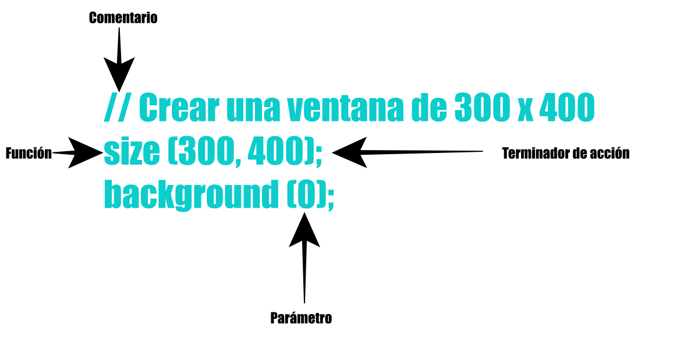

# 2. Estructuras: Elementos del Código

## Elementos que se introducen en esta Unidad:

* // (comentario)
* /* */ (comentario multilinea)
* ; (terminador de acción)
* , (coma)
* print()
* printl()

El hecho de crear un programa implica recurrir a la escritura y aprender un lenguaje. Similar a cuando aprendemos un nuevo lenguaje oral o escrito, necesitamos aprender una sintaxis y una lógica. Escribir en un lenguaje humano es muy complicado. Posee ambigüedad en las palabras, y mucha flexibilidad para la construcción de párrafos. En ese sentido, el lenguaje de máquina es más sencillo, pero posee una dificultad clara: la lógica de la programación. Usualmente, un ser humano puede percatarse de un error de sintaxis y darlo por alto, restándole parcial o completa importancia. Sin embargo, en un lenguaje de máquina las cosas son de una forma o de otra: O está bien, o está mal.

## Comentarios

Los comentarios son ignorados por los ordenadores, pero son **muy importantes** para los humanos. Processing permite agregar notas en cualquier sector del código. Pueden ser de solo una linea o de muchas líneas. Ya que los programas usan signos muy arcaicos y de difícil identificeción, muchas veces es complicado recordar que hacía cada sector individualmente. Por lo tanto se recurre a la utilidad del comentario, muy útil a la hora de revisar el código, ya sea por el propio programador como por otros. El siguiente programa explica, por sí solo, como se comenta:

```processing
    // Dos barras laterales son usadas para comentar
    // Todo el texto en la misma línea es parte de un comentario
    // No debe haber espacio entre las barras, por ejemplo "/ /", de lo contrario
    // el comentario no funcionará.

    // Si desea muchas líneas
    // lo ideal es usar el método multilinea.

    /*
    Una barra lateral seguida por un asterisco
    permite el comentario de multilinea.
    */
```

## Funciones

Las funciones permiten dibujar formas, colores, realizar cálculos matemáticos, entre otras variadas acciones. Por lo general **se escriben en minúsculas y seguidas por paréntesis**. Algunas funciones aceptan parámetros, los cuales se escriben entre paréntesis. Si acepta más de uno, son separados por una coma (**,**). A continuación un programa que incluye dos funciones: size() y background().

```processing
    // Con esta función establecemos el tamaño de la ventana de presentación
    // El primer parámetro corresponde al ancho de la ventana
    // El segundo parámetro corresponde al alto
    size (400, 300);

    // Con esta función establecemos el color de fondo de la ventana
    // Acepta diversos parámetros, para una escala de grises bastará con valores de 0 (negro) a 255 (blanco)
    background (0);
```

## Expresiones y Acciones

Si usáramos una analogía, la expresión de un software es como una frase. Las expresiones, por lo general,
van acompañadas de algún operador como +, -, * o /, ya sea a la izquierda o la derecha del valor. Una expresión en programación puede ser básica, como un solo número, o una compleja cadena de elementos. De esta manera, una expresión siempre tiene un valor determinado.



|       Expresión       |       Valor       |
|:---------------------:|:-----------------:|
|5|5|
|10.5 * 2|21.0|
|((3 + 2) * -10) + 1|-49|

Hay expresiones que también pueden usarse en comparación de un valor con otro. Los operadores de > /mayor a/ y < /menor a/ devuelven solo dos valores: true (verdadero) y false (falso).

|       Expresión       |       Valor       |
|:---------------------:|:-----------------:|
|6 > 3|true|
|54 < 50|false|

Un conjunto de expresiones pueden formar una acción, lo que en programación equivale a una oración. Se completa cuando se presenta el terminador de la acción. En Processing, el terminador de acción es el punto y coma (**,**). Al igual que hay diversos tipos de oraciones, hay diversos tipos de acciones. Una acción puede definir una variable, ejecutar una variable, asignar una variable, ejecutar una función, o construir un objeto. A continuación unos ejemplos:

```processing
    size (200, 200);    // ejecuta la función size y determina los valores 200 y 200
    int x;              // declara una nueva variable
    x = 102;            // asigna un valor a la variable
    background (x);     // ejecuta la función background
```

Si se elimina el punto y coma, el programa daría un error.