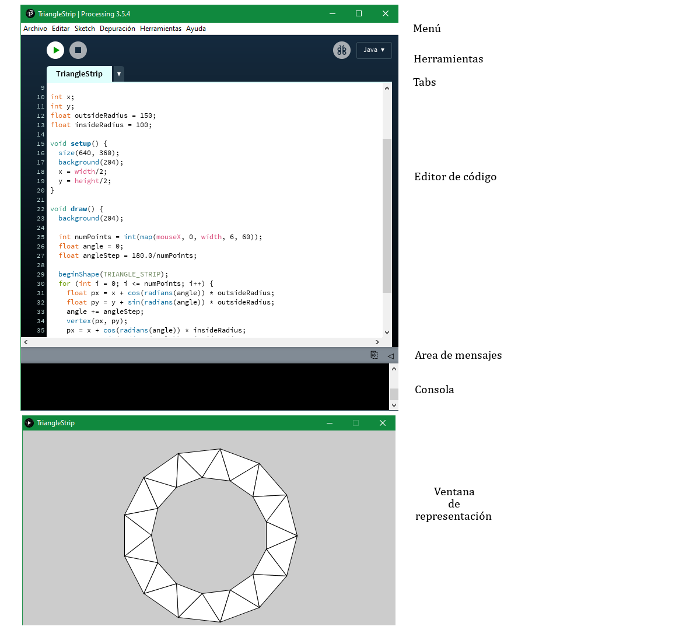

# 1. Introducción
## Introducción

Dado el avance de los medios de producción multimedia, nace un potente software dedicado a la producción de imágenes, animaciones e interactivos. El software denominado Processing. El proyecto da inicio en el 2001, realizado por Casey Reas y Ben Fry, a partir de terminologías realizadas en el MIT Lab, dirigido por John Maeda, e influenciado por el proyecto Design by Numbers. Es así que processing se convierte en un poderoso entorno de producción basado en Java.

## Software

**¿Qué es Processing?**

Es un software de código abierto, y cualquier persona puede contribuir en su mejora. Deprovisto de interfaces innecesarias, se vale de un lenguaje de programación (de igual nombre) basado en Java para realizar composiciones de gran interés. 

Como software, consiste básicamente en un simple editor de texto para escribir código, un área de mensajes, una consola de texto, un sistema de pestañas para manejar archivos, una barra de herramientas con botones de accionar común y una barra de menú. Cuando el programa se ejecuta, se abre una ventana de representación. Los archivos que se escriben en Processing se denominan *sketch*. Esos sketch se escriben en el editor de texto. Admite las funciones de copiar/pegar y buscar/reemplazar texto. La consola muestra errores producidos al ejecutar el programa. También, puede mostrar texto a travéz de las funciones *print()* y *println()*.

## Descarga

El software de Processing puede descargarse del sitio web homónimo del programa. Desde un navegador web, ingresar a [www.processing.org](https://www.processing.org "processing") y buscar la sección de descarga (download). Admite sistemas operativos de Linux, Macintosh y Windows. En el sitio se encuentran las instrucciones mismas para la descarga.

## Contexto

* Barra de menú:
    * File:/Archivo/. Comandos para manejar y exportar archivos.
    * Edit:/Editar/. Controles para editar texto. (Copiar, pegar, cortar, encontrar, reemplazar, etc.).
    * Sketch:/Sketch/. Control para ejecutar/frenar el programa y para añadir librerías.
    * Tools:/Herramientas/. Herramientas de asistencia para Processing.
    * Help:/Ayuda/. Referencias a archivos y al lenguaje.

* Barra de herramientas:
    * Run:/Ejecutar/. Compila el código, abre una ventana de representación y muestra el programa.
    * Stop:/Parar/. Termina de correr el programa.
    * New:/Nuevo/. Crea un nuevo Sketch.
    * Open:/Abrir/. Provee de opciones para abrir un sketch, abrir un ejemplo, o un sketch en cualquier sitio del ordenador.
    * Save:/Guardar/. Guardar el actual sketch en la actual ubicación. Para otra ubicación usar la opción "Save as".
    * Export:/Exportar/. Exportar el actual sketch como un applet de Java unido a un archivo HTML.